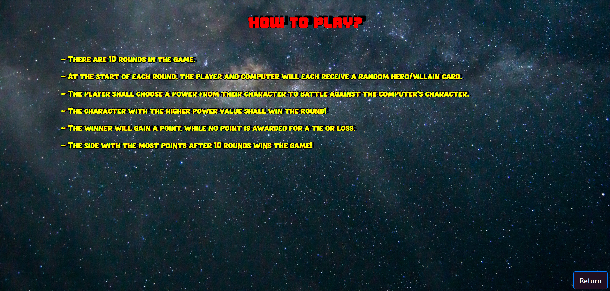
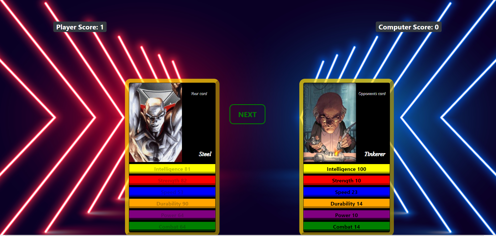
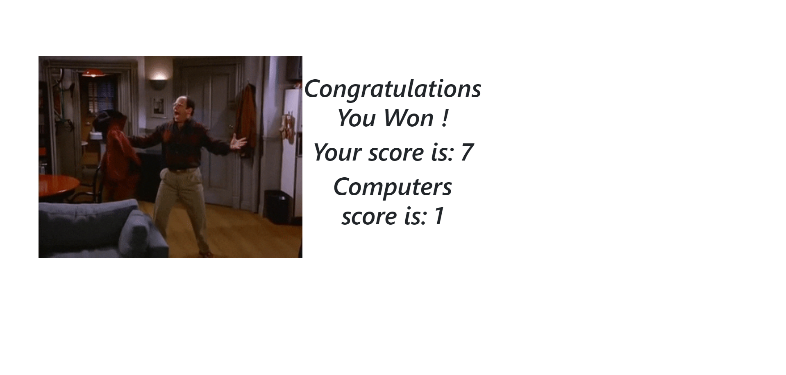

# Superhero Trump Game  

## Description  
Welcome! This project features a Trump card game, in which players battle against the computer with superheros and villains!

In this game, the player and computer contest against each other using a selected power from their heroes card. The player with higher power wins the game! 

This application was made with Bootstrap library, a superheroes API, and the gfycat API.

## Prerequisites  
A web browser is required to access the application.

## Usage

### Application link
The application can be accessed using this URL: https://pandi1813.github.io/Project---Multiverse-Trumps-Game/

### Application usage

#### Start screen
  
On the start screen, players can click on the **PLAY** button to start the game, or **RULES** button to see the game rules.

#### Rules screen
  
In the rules screen, players can learn how to play the game.

#### Game screen
  
- There are 10 rounds in the game
- To proceed with a game round, the player shall select a power from his/her hero card
- Once a power is selected, the computer's card will be revealed and the scores are calculated
- To proceed to the next round, the player can click on the **NEXT** button
- After the final round, the player can click on the **FINISH** button to complete the game

#### End screen
  
At the end screen, players can see the game results and score. They will also be presented with a reaction gif based on the game results.

## Acknowledgments
- [Superheroes API](https://akabab.github.io/superhero-api/)
- [Gfycat API](https://developers.gfycat.com/api/)
